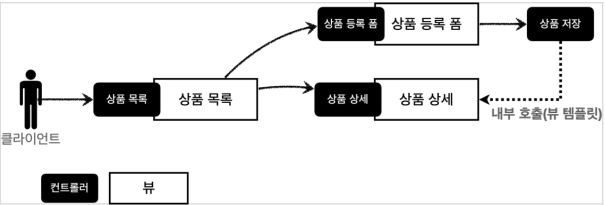
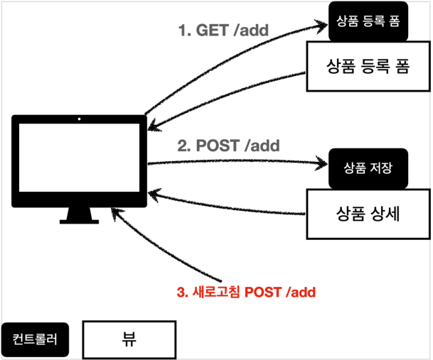
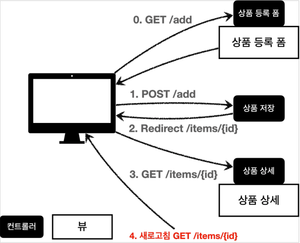
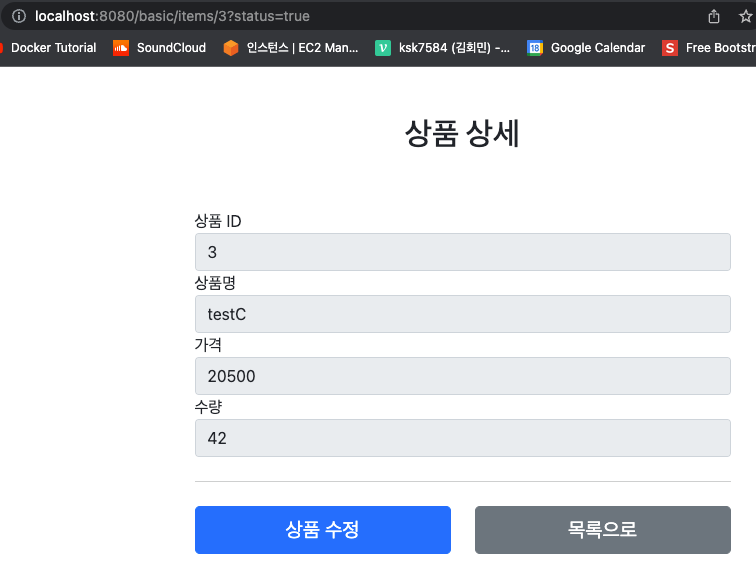

# 스프링 MVC - 웹페이지 만들기
## 프로젝트 생성
### Welcome 페이지 추가
`src/main/resources/static/index.html`
```html
<!DOCTYPE html>
<html>
<head>
    <meta charset="UTF-8">
    <title>Title</title>
</head>
<body>
<ul>
    <li>상품 관리
        <ul>
            <li><a href="/basic/items">상품 관리 - 기본</a></li>
        </ul>
    </li>
</ul>
</body>
</html>
```

## 요구사항 분석
### 상품 도메인 모델
* 상품 ID
* 상품명
* 가격
* 수량

### 상품 관리 기능
* 상품 목록
* 상품 상세
* 상품 등록
* 상품 수정

### 서비스 화면


### 서비스 제공 흐름


## 상품 도메인 개발
### Item - 상품 객체
```java
@Setter @Getter
public class Item {
    private Long id;
    private String itemName;
    private Integer price;
    private Integer quantity;

    public Item() {}

    public Item(String itemName, Integer price, Integer quantity) {
        this.itemName = itemName;
        this.price = price;
        this.quantity = quantity;
    }
}
```

### ItemRepository - 상품 저장소
```java
/**
 * InMemory 방식 Item 저장소
 */
@Repository
public class ItemRepository {
    private static final Map<Long, Item> store = new HashMap<>();
    private static long sequence = 0L;

    /**
     * Item 저장
     * @param item
     * @return 생성한 Item
     */
    public Item save(Item item) {
        item.setId(++sequence);
        store.put(item.getId(), item);
        return item;
    }

    /**
     * Item 하나 찾기
     * @param id
     * @return 찾은 Item
     */
    public Item findById(Long id) {
        return store.get(id);
    }

    /**
     * 모든 Item 복사해서 반환
     * @return 모든 Items
     */
    public List<Item> findAll() {
        return new ArrayList<>(store.values());
    }

    /**
     * Item 정보 수정
     * @param itemId
     * @param updateItem
     */
    public void update(
            Long itemId, Item updateItem
    ) {
        Item findItem = findById(itemId);
        findItem.setItemName(updateItem.getItemName());
        findItem.setPrice(updateItem.getPrice());
        findItem.setQuantity(updateItem.getQuantity());
    }

    /**
     * 메모리에 저장된 모든 Item 제거
     */
    public void clearStore() {
        store.clear();
    }
}
```

### 상품 저장소 테스트
```java
class ItemRepositoryTest {
    ItemRepository itemRepository = new ItemRepository();

    @AfterEach
    void afterEach() {
        itemRepository.clearStore();
    }

    @Test
    void save() {
        // given
        Item item = new Item("itemA", 1000, 10);

        // when
        Item savedItem = itemRepository.save(item);

        // then
        Item findItem = itemRepository.findById(savedItem.getId());
        Assertions.assertThat(findItem).isEqualTo(savedItem);
    }

    @Test
    void findAll() {
        // given
        Item itemA = new Item("itemA", 1000, 10);
        Item itemB = new Item("itemB", 2000, 1000);

        itemRepository.save(itemA);
        itemRepository.save(itemB);

        // when
        List<Item> findItems = itemRepository.findAll();

        // then
        Assertions.assertThat(findItems.size()).isEqualTo(2);
        Assertions.assertThat(findItems).contains(itemA, itemB);
    }

    @Test
    void update() {
        // given
        Item itemA = new Item("itemA", 1000, 10);
        Item itemB = new Item("itemB", 3000, 100);
        itemRepository.save(itemA);

        // when
        itemRepository.update(itemA.getId(), itemB);
        Item findItem = itemRepository.findById(itemA.getId());

        // then
        Assertions.assertThat(findItem).isEqualTo(itemA);
        Assertions.assertThat(findItem.getItemName()).isEqualTo(itemA.getItemName());
        Assertions.assertThat(findItem.getItemName()).isEqualTo(itemB.getItemName());
        Assertions.assertThat(itemA).isNotEqualTo(itemB);
    }
}
```

## 상품 서비스 HTML
### 상품 목록 HTML
```html
<!DOCTYPE HTML>
<html>
<head>
  <meta charset="utf-8">
  <link href="../css/bootstrap.min.css" rel="stylesheet">
</head>
<body>
<div class="container" style="max-width: 600px">
  <div class="py-5 text-center">
    <h2>상품 목록</h2>
  </div>
  <div class="row">
    <div class="col">
      <button class="btn btn-primary float-end"
              onclick="location.href='addForm.html'" type="button">상품
        등록</button>
    </div>
  </div>
  <hr class="my-4">
  <div>
    <table class="table">
      <thead>
      <tr>
        <th>ID</th>
        <th>상품명</th>
        <th>가격</th>
        <th>수량</th>
      </tr>
      </thead>
      <tbody>
      <tr>
        <td><a href="item.html">1</a></td>
        <td><a href="item.html">테스트 상품1</a></td>
        <td>10000</td>
        <td>10</td>
      </tr>
      <tr>
        <td><a href="item.html">2</a></td>
        <td><a href="item.html">테스트 상품2</a></td>
        <td>20000</td>
        <td>20</td>
      </tr>
      </tbody>
    </table>
  </div>
</div> <!-- /container -->
</body>
</html>
```

### 상품 상세 HTML
```html
<!DOCTYPE HTML>
<html>
<head>
    <meta charset="utf-8">
    <link href="../css/bootstrap.min.css" rel="stylesheet">
    <style>
 .container {
 max-width: 560px;
 }
 </style>
</head>
<body>
<div class="container">
    <div class="py-5 text-center">
        <h2>상품 상세</h2>
    </div>
    <div>
        <label for="itemId">상품 ID</label>
        <input type="text" id="itemId" name="itemId" class="form-control"
               value="1" readonly>
    </div>
    <div>
        <label for="itemName">상품명</label>
        <input type="text" id="itemName" name="itemName" class="form-control"
               value="상품A" readonly>
    </div>
    <div>
        <label for="price">가격</label>
        <input type="text" id="price" name="price" class="form-control"
               value="10000" readonly>
    </div>
    <div>
        <label for="quantity">수량</label>
        <input type="text" id="quantity" name="quantity" class="form-control"
               value="10" readonly>
    </div>
    <hr class="my-4">
    <div class="row">
        <div class="col">
            <button class="w-100 btn btn-primary btn-lg"
                    onclick="location.href='editForm.html'" type="button">상품 수정</button>
        </div>
        <div class="col">
            <button class="w-100 btn btn-secondary btn-lg"
                    onclick="location.href='items.html'" type="button">목록으로</button>
        </div>
    </div>
</div> <!-- /container -->
</body>
</html>
```

### 상품 수정 HTML
```html
<!DOCTYPE HTML>
<html>
<head>
    <meta charset="utf-8">
    <link href="../css/bootstrap.min.css" rel="stylesheet">
    <style>
 .container {
 max-width: 560px;
 }
 </style>
</head>
<body>
<div class="container">
    <div class="py-5 text-center">
        <h2>상품 수정 폼</h2>
    </div>
    <form action="item.html" method="post">
        <div>
            <label for="id">상품 ID</label>
            <input type="text" id="id" name="id" class="form-control" value="1"
                   readonly>
        </div>
        <div>
            <label for="itemName">상품명</label>
            <input type="text" id="itemName" name="itemName" class="formcontrol" value="상품A">
        </div>
        <div>
            <label for="price">가격</label>
            <input type="text" id="price" name="price" class="form-control"
                   value="10000">
        </div>
        <div>
            <label for="quantity">수량</label>
            <input type="text" id="quantity" name="quantity" class="formcontrol" value="10">
        </div>
        <hr class="my-4">
        <div class="row">
            <div class="col">
                <button class="w-100 btn btn-primary btn-lg" type="submit">저장
                </button>
            </div>
            <div class="col">
                <button class="w-100 btn btn-secondary btn-lg"
                        onclick="location.href='item.html'" type="button">취소</button>
            </div>
        </div>
    </form>
</div> <!-- /container -->
</body>
</html>
```

### 상품 추가 HTML
```html
<!DOCTYPE HTML>
<html>
<head>
  <meta charset="utf-8">
  <link href="../css/bootstrap.min.css" rel="stylesheet">
  <style>
 .container {
 max-width: 560px;
 }
 </style>
</head>
<body>
<div class="container">
  <div class="py-5 text-center">
    <h2>상품 등록 폼</h2>
  </div>
  <h4 class="mb-3">상품 입력</h4>
  <form action="item.html" method="post">
    <div>
      <label for="itemName">상품명</label>
      <input type="text" id="itemName" name="itemName" class="formcontrol" placeholder="이름을 입력하세요">
    </div>
    <div>
      <label for="price">가격</label>
      <input type="text" id="price" name="price" class="form-control"
             placeholder="가격을 입력하세요">
    </div>
    <div>
      <label for="quantity">수량</label>
      <input type="text" id="quantity" name="quantity" class="formcontrol" placeholder="수량을 입력하세요">
    </div>
    <hr class="my-4">
    <div class="row">
      <div class="col">
        <button class="w-100 btn btn-primary btn-lg" type="submit">상품
          등록</button>
      </div>
      <div class="col">
        <button class="w-100 btn btn-secondary btn-lg"
                onclick="location.href='items.html'" type="button">취소</button>
      </div>
    </div>
  </form>
</div> <!-- /container -->
</body>
</html>
```

## 상품 목록 - 타임리프
### BasicItemController
```java
@Controller
@RequestMapping("/basic/items")
@RequiredArgsConstructor
public class BasicItemController {
    private final ItemRepository itemRepository;

    @GetMapping
    public String items(
            Model model
    ) {
        List<Item> items = itemRepository.findAll();
        model.addAttribute("items", items);
        return "basic/items";
    }

    /**
     * 테스트용 데이터 추가
     * 해당 빈의 의존관계가 모두 주입되고 나서 호출
     */
    @PostConstruct
    public void init() {
        itemRepository.save(new Item("testA", 10000, 10));
        itemRepository.save(new Item("testB", 20000, 20));
    }
}
```

### Items HTML 수정
`src/main/resources/templates/basic/items.html`
```html
<!DOCTYPE HTML>
<html xmlns:th="http://www.thymeleaf.org">
<head>
    <meta charset="utf-8">
    <link href="../css/bootstrap.min.css"
          th:href="@{/css/bootstrap.min.css}" rel="stylesheet">
</head>
<body>
<div class="container" style="max-width: 600px">
    <div class="py-5 text-center">
        <h2>상품 목록</h2>
    </div>
    <div class="row">
        <div class="col">
            <button class="btn btn-primary float-end"
                    onclick="location.href='addForm.html'"
                    th:onclick="|location.href='@{/basic/items/add}'|"
                    type="button">상품 등록</button>
        </div>
    </div>
    <hr class="my-4">
    <div>
        <table class="table">
            <thead>
            <tr>
                <th>ID</th>
                <th>상품명</th>
                <th>가격</th>
                <th>수량</th>
            </tr>
            </thead>
            <tbody>
            <tr th:each="item : ${items}">
                <td><a href="item.html" th:href="@{/basic/items/{itemId} (itemId=${item.id})}" th:text="${item.id}">회원id</a></td>
                <td><a href="item.html" th:href="@{|/basic/items/${item.id}|}"
                       th:text="${item.itemName}">상품명</a></td>
                <td th:text="${item.price}">10000</td>
                <td th:text="${item.quantity}">10</td>
            </tr>
            </tbody>
        </table>
    </div>
</div> <!-- /container -->
</body>
</html>
```

### 타임리프 간단히 알아보기
#### 사용 선언
`<html xmlns:th="http://www.thymeleaf.org">`

#### 속성 변경 - th:href
`th:href="@{/css/bootstrap.min.css}"`

#### 타임리프 핵심
* 핵심은 `th:xxx`가 붙은 부분은 서버사이드에서 렌더일되고, 기존 것을 대체한다.
* `th:xxx`가 없으면 기존의 속성이 그대로 사용된다.
* HTML을 파일로 직접 열었을 때, `th:xxx`가 있어도 웹 브라우저는 무시한다.
* 따라서 HTML을 파일 보기를 유지하면서 템플릿 기능도 할 수 있다.
* 이렇게 **순수 HTML을 그대로 유지하면서 뷰 템플릿도 사용할 수 있는 타임리프의 특징을 네츄럴 템플릿(natural templates)**이라 한다.

#### URL 링크 표현식 - @{...}
`th:href="@{/css/bootstrap.min.css}"`
* `@{...}`: URL 링크를 사용하는 경우 사용한다. 이것을 URL 링크 표현식이라 한다.
* URL 링크 표현식을 사용하면 서블릿 컨텍스트를 자동으로 포함한다.

#### 상품 등록 폼으로 이동
`th:onclick="|location.href='@{/basic/items/add}'|"`
* 속성 변경: `th:onclick`
* 리터럴 대체: `|...|`
  * 문자와 표현식 등은 분리되어 있기 때문에 더해서 사용해야 한다.
    * `<span th:text="'Welcome to our application, ' + ${user.name} + '!'">`
  * 다음과 같이 리터럴 대체 문법을 사용하면, 더하기 없이 편리하게 사용할 수 있다.
    * `<span th:text="|Welcome to our application, ${user.name}!|">`

#### 반복 출력 - th:each
`<tr th:each="item: ${items}">`

#### 변수 표현식 - ${...}, 내용 변경 - th:text
`<td th:text="${item.price}"> 0 </td>`

## 상품 상세
### BasicItemController 에 추가
```java
@Controller
@RequestMapping("/basic/items")
@RequiredArgsConstructor
public class BasicItemController {
    private final ItemRepository itemRepository;

    @GetMapping("/{itemId}")
    public String item(
            @PathVariable Long itemId,
            Model model
    ) {
        Item item = itemRepository.findById(itemId);
        model.addAttribute("item", item);
        return "basic/item";
    }

    /**
     * 테스트용 데이터 추가
     * 해당 빈의 의존관계가 모두 주입되고 나서 호출
     */
    @PostConstruct
    public void init() {
        itemRepository.save(new Item("testA", 10000, 10));
        itemRepository.save(new Item("testB", 20000, 20));
    }
}
```

### 상품 상세 HTML
```html
<!DOCTYPE HTML>
<html xmlns:th="http://www.thymeleaf.org">
<head>
    <meta charset="utf-8">
    <link href="../css/bootstrap.min.css"
          th:href="@{/css/bootstrap.min.css}" rel="stylesheet">
    <style>
 .container {
 max-width: 560px;
 }
 </style>
</head>
<body>
<div class="container">
    <div class="py-5 text-center">
        <h2>상품 상세</h2>
    </div>
    <div>
        <label for="itemId">상품 ID</label>
        <input type="text" id="itemId" name="itemId" class="form-control"
               value="1" th:value="${item.id}" readonly>
    </div>
    <div>
        <label for="itemName">상품명</label>
        <input type="text" id="itemName" name="itemName" class="form-control"
               value="상품A" th:value="${item.itemName}" readonly>
    </div>
    <div>
        <label for="price">가격</label>
        <input type="text" id="price" name="price" class="form-control"
               value="10000" th:value="${item.price}" readonly>
    </div>
    <div>
        <label for="quantity">수량</label>
        <input type="text" id="quantity" name="quantity" class="form-control"
               value="10" th:value="${item.quantity}" readonly>
    </div>
    <hr class="my-4">
    <div class="row">
        <div class="col">
            <button class="w-100 btn btn-primary btn-lg"
                    onclick="location.href='editForm.html'"
                    th:onclick="|location.href='@{/basic/items/{itemId}/edit(itemId=${item.id})}'|" type="button">상품 수정</button>
        </div>
        <div class="col">
            <button class="w-100 btn btn-secondary btn-lg"
                    onclick="location.href='items.html'"
                    th:onclick="|location.href='@{/basic/items}'|"
                    type="button">목록으로</button>
        </div>
    </div>
</div> <!-- /container -->
</body>
</html>
```

## 상품 등록 폼
```java
@Controller
@RequestMapping("/basic/items")
@RequiredArgsConstructor
public class BasicItemController {
    @GetMapping("/add")
    public String addItem() {
        return "basic/addForm";
    }
}
```

```html
<!DOCTYPE HTML>
<html xmlns:th="http://www.thymeleaf.org">
<head>
  <meta charset="utf-8">
  <link href="../css/bootstrap.min.css"
        th:href="@{/css/bootstrap.min.css}" rel="stylesheet">
  <style>
 .container {
 max-width: 560px;
 }
 </style>
</head>
<body>
<div class="container">
  <div class="py-5 text-center">
    <h2>상품 등록 폼</h2>
  </div>
  <h4 class="mb-3">상품 입력</h4>
  <form action="item.html" th:action method="post">
    <div>
      <label for="itemName">상품명</label>
      <input type="text" id="itemName" name="itemName" class="formcontrol" placeholder="이름을 입력하세요">
    </div>
    <div>
      <label for="price">가격</label>
      <input type="text" id="price" name="price" class="form-control"
             placeholder="가격을 입력하세요">
    </div>
    <div>
      <label for="quantity">수량</label>
      <input type="text" id="quantity" name="quantity" class="formcontrol" placeholder="수량을 입력하세요">
    </div>
    <hr class="my-4">
    <div class="row">
      <div class="col">
        <button class="w-100 btn btn-primary btn-lg" type="submit">상품
          등록</button>
      </div>
      <div class="col">
        <button class="w-100 btn btn-secondary btn-lg"
                onclick="location.href='items.html'"
                th:onclick="|location.href='@{/basic/items}'|"
                type="button">취소</button>
      </div>
    </div>
  </form>
</div> <!-- /container -->
</body>
</html>
```

## 상품 등록 처리 - `@ModelAttribute`
### POST - HTML Form
* `Content-Type: applcation/x-www-form-urlencoded`
* 메시지 바디에 쿼리 파라미터 형식으로 전달

### 상품 등록 처리 V1
```java
@Controller
@RequestMapping("/basic/items")
@RequiredArgsConstructor
public class BasicItemController {
  private final ItemRepository itemRepository;

  @PostMapping("/add")
  public String addItemV1(
          @RequestParam String itemName,
          @RequestParam int price,
          @RequestParam Integer quantity,
          Model model
  ) {
    Item item = new Item(itemName, price, quantity);
    itemRepository.save(item);
    model.addAttribute("item", item);
    return "basic/item";
  }
}
```
* 먼저 `@RequestParam String itemName`: itemName 요청 파라미터 데이터를 해당 변수에 받는다.
* `Item` 객체를 생성해서 `itemRepository`를 통해서 저장한다.
* 저장된 `item`을 `model`에 담아서 뷰에 전달한다.

### 상품 등록 처리 V2
```java
@Controller
@RequestMapping("/basic/items")
@RequiredArgsConstructor
public class BasicItemController {
  private final ItemRepository itemRepository;

  @PostMapping("/add")
  public String addItemV2(
          @ModelAttribute("item") Item item,
          Model model
  ) {
    itemRepository.save(item);
    // model.addAttribute("item", item); // 생략 가능
    return "basic/item";
  }
}
```
* `Item`객체를 생성하고, 요청 파라미터의 값을 **프로퍼티 접근법**(setXxx)으로 입력한다.
* `Model`에 `@ModelAttribute`에 **지정한 객체**(Item)를 자동으로 넣어준다.
  * `model.addAttribute("item", item);`를 생략해도 된다.
  * `@ModelAttribute(name = "hello") Item item`: 이름을 `hello`로 지정
    * `model.addAttribute("hello", item);`과 같다.

### 상품 등록 처리 V3
```java
@Controller
@RequestMapping("/basic/items")
@RequiredArgsConstructor
public class BasicItemController {
  private final ItemRepository itemRepository;

  @PostMapping("/add")
  public String addItemV3(
          @ModelAttribute Item item
  ) {
    itemRepository.save(item);
    return "basic/item";
  }
}
```
* `@ModelAttribute`의 name 인자를 생략해도 된다.
* 이때, 변수명이 아닌, **Class 이름의 첫 글자만 소문자로 변경해서 등록**(Camel)한다.
  * `Item` -> `item`
  * `HelloWorld` -> `helloWorld`

### 상품 등록 처리 V4
```java
@Controller
@RequestMapping("/basic/items")
@RequiredArgsConstructor
public class BasicItemController {
  private final ItemRepository itemRepository;

  @PostMapping("/add")
  public String addItemV4(
          Item item
  ) {
    itemRepository.save(item);
    return "basic/item";
  }
}
```
* `@ModelAttribute`를 생략할 수 있으나, 권장하지는 않는다.

## 상품 수정
### 상품 수정 폼 컨트롤러
```java
@Controller
@RequestMapping("/basic/items")
@RequiredArgsConstructor
public class BasicItemController {
  private final ItemRepository itemRepository;

  @GetMapping("/{itemId}/edit")
  public String editForm(
          @PathVariable Long itemId,
          Model model
  ) {
    Item item = itemRepository.findById(itemId);
    model.addAttribute("item", item);
    return "basic/editForm";
  }
}
```

### 상품 수정 폼 컨트롤러
```html
<!DOCTYPE HTML>
<html xmlns:th="http://www.thymeleaf.org">
<head>
    <meta charset="utf-8">
    <link href="../css/bootstrap.min.css"
          th:href="@{/css/bootstrap.min.css}" rel="stylesheet">
    <style>
 .container {
 max-width: 560px;
 }
 </style>
</head>
<body>
<div class="container">
    <div class="py-5 text-center">
        <h2>상품 수정 폼</h2>
    </div>
    <form action="item.html" th:action method="post">
        <div>
            <label for="id">상품 ID</label>
            <input type="text" id="id" name="id" class="form-control" value="1"
                   th:value="${item.id}" readonly>
        </div>
        <div>
            <label for="itemName">상품명</label>
            <input type="text" id="itemName" name="itemName" class="formcontrol" value="상품A" th:value="${item.itemName}">
        </div>
        <div>
            <label for="price">가격</label>
            <input type="text" id="price" name="price" class="form-control"
                   th:value="${item.price}">
        </div>
        <div>
            <label for="quantity">수량</label>
            <input type="text" id="quantity" name="quantity" class="formcontrol" th:value="${item.quantity}">
        </div>
        <hr class="my-4">
        <div class="row">
            <div class="col">
                <button class="w-100 btn btn-primary btn-lg" type="submit">저장
                </button>
            </div>
            <div class="col">
                <button class="w-100 btn btn-secondary btn-lg"
                        onclick="location.href='item.html'"
                        th:onclick="|location.href='@{/basic/items/{itemId}(itemId=${item.id})}'|"
                        type="button">취소</button>
            </div>
        </div>
    </form>
</div> <!-- /container -->
</body>
</html>
```

### 상품 수정 개발
```java
@Controller
@RequestMapping("/basic/items")
@RequiredArgsConstructor
public class BasicItemController {
  private final ItemRepository itemRepository;

  @PostMapping("/{itemId}/edit")
  public String edit(
          @PathVariable Long itemId,
          @ModelAttribute Item item
  ) {정
    itemRepository.update(itemId, item);
    return "redirect:/basic/items/{itemId}";
  }
}
```

### Redirect
* 스프링은 `redirect:`로 편리하게 리다이렉트를 지원한다.
* `redirect:/basic/items/{itemId}`
  * 컨트롤러에 매핑된 `@PathVariable`의 값은 `redirect`에도 사용할 수 있다.
  * `{itemId}`는 `@PatchVariable Long itemId`의 값을 그대로 사용한다.

> **참고**<br>
> HTML Form 전송은 PUT, PATCH를 지원하지 않는다. GET, POST만 사용할 수 있다.
> PUT, PATCH는 HTTP API 전송시에 사용
> 스프링에서 HTTP POST로 Form 요청할 때 히든 필드를 통해서 PUT, PATCH 매핑을 사용하는 방법이 있지만, HTTP 요청상 POST 요청이다.

## PRG Post-Redirect-Get
* 사실 지금까지 진행한 상품 등록 처리 컨트롤러는 심각한 문제가 있다. (`addItem`)
* 상품 등록을 완료하고 웹 브라우저의 새로고침 버튼을 클릭해보자.
* 상품이 계속해서 중복 등록되는 것을 확인할 수 있다.

### 전체 흐름


### POST 등록 후 새로 고침

* 웹 브라우저의 새로 고침은 마지막에 서버에 전송한 데이터를 다시 전송한다.
* 상품 등록 폼에서 데이터를 입력하고 저장을 선택하면 `POST /add` + 상품 데이터를 서버로 전송한다.
* 이 상태에서 새로 고침을 누르면 마지막에 전송된 `POST /add` + 상품 데이터를 서버로 다시 전송한다.
* 그래서 내용은 같고, ID만 다른 상품 데이터가 계속 쌓이게 된다.

### POST, Redirect GET

* 웹 브라우저의 새로 고침은 마지막에 서버에 전송한 데이터를 다시 전송한다.
* 새로 고침 문제를 해결하려면 상품 저장 후에 뷰 템플릿으로 이동하는 것이 아니라, 상품 상세 화면으로 리다이렉트를 호출해주면 된다.
* 웹 브라우저는 리다이렉트의 영향으로 상품 저장 후에 실제 상품 상세 화면으로 다시 이동한다.
* 따라서 마지막에 호출한 내용이 상품 상세 화면인 `GET /items/{itemId}`가 되는 것이다.

```java
@Controller
@RequestMapping("/basic/items")
@RequiredArgsConstructor
public class BasicItemController {
  private final ItemRepository itemRepository;

  @GetMapping("/add")
  public String addItem() {
    return "basic/addForm";
  }

  @PostMapping("/add")
  public String addItemV3(
          @ModelAttribute Item item
  ) {
    itemRepository.save(item);
    return "redirect:/basic/items/" + item.getId();
  }
}
```
* 위와 같이 Post 이후 Redirect 를 이용해 Get 요청을 보내줘야 한다.
* 이를 **Post-Redirect-Get, 줄여서 PRG** 라 한다.

> **주의**<br>
> * `"redirect:/basic/items/" + item.getId()`에서 `+ item.getId()`처럼 **URL에 변수를 더해서 사용하면 안된다.**
> * 이유는 URL 인코딩이 안되기 떄문인데, 이는 `RedirectAttribute`를 사용하여 해결하자.

## RedirectAttribute
* 상품을 저장하고 상품 상세 화면으로 리다이렉트한 것 까지는 좋았다.
* 하지만 고객 입장에서 저장이 잘 된 것인지 안 된 것인지 확신이 들지않는다.
* 그래서 저장이 잘 되었으면 상품 상세 화면에 "저장되었습니다"라는 메시지를 보여달라는 요구사항이 왔다.

### BasicItemController 에 추가
```java
@Controller
@RequestMapping("/basic/items")
@RequiredArgsConstructor
public class BasicItemController {
  private final ItemRepository itemRepository;
  
/*
  @PostMapping("/add")
  public String addItemV3(
          @ModelAttribute Item item
  ) {
    itemRepository.save(item);
    return "redirect:/basic/items/" + item.getId();
  }
*/
  @PostMapping("/add")
  public String addItemV6(
          @ModelAttribute Item item,
          RedirectAttributes redirectAttributes
  ) {
    Item savedItem = itemRepository.save(item);
    redirectAttributes.addAttribute("itemId", savedItem.getId());
    redirectAttributes.addAttribute("status", true);
    return "redirect:/basic/items/{itemId}";
  }
}
```

* `ReirectAttribute`는 **URL Encoding + PathVariable + Query Parameter** 까지 처리해준다.
* `redirectAttributes.addAttribute("itemId", savedItem.getId())`
  * PathVariable 바인딩: `return "redirect:/basic/items/{itemId}"`
* `redirectAttributes.addAttribute("status", true)`
  * Query Parameter 처리: `?status=true`

### 뷰 템플릿에 추가
```html
<div class="container">
    <div class="py-5 text-center">
        <h2>상품 상세</h2>
    </div>

    <!-- Alert 추가 -->
    <h2 th:if="${param.status}" th:text="'저장 완료'"></h2>
</div>
```
* `th:if`: 해당 조건이 참이면 실행
* `${param.status}`: Query Parameter 조회

## 정리
